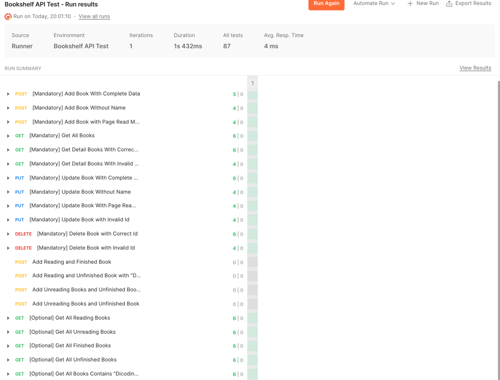

# Submission Bookshelf API

## Kelas Belajar Membuat Aplikasi Back-End untuk Pemula

https://www.dicoding.com/academies/261/tutorials/14777

## Hasil Test menggunakan Postman

## Cara Menjalankan Aplikasi

1. Pastikan sudah terinstall Node.js
2. Buka terminal
3. Jalankan perintah `npm install`
4. Jalankan perintah `npm start`
5. Buka aplikasi Postman
6. Import file `Submission Bookshelf API.postman_collection.json` dan `Bookshelf API Test.postman_environment.json` ke dalam Postman
7. Jalankan request yang ada di dalam Postman
8. Aplikasi dapat diakses melalui `http://localhost:5000`

