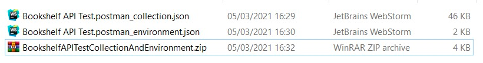
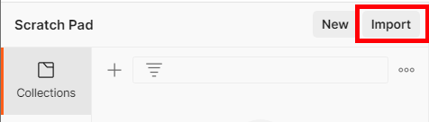
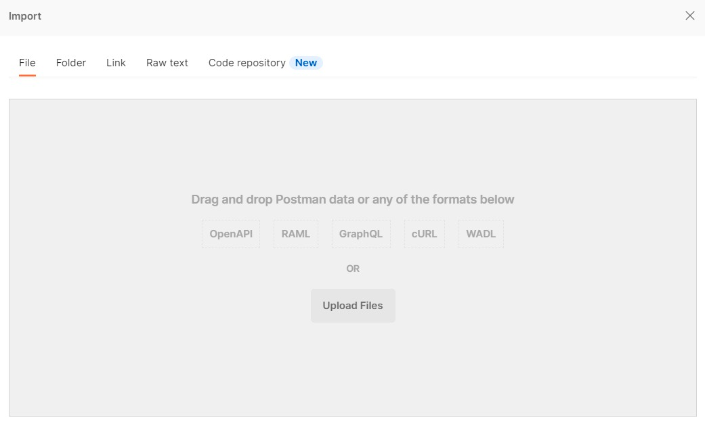
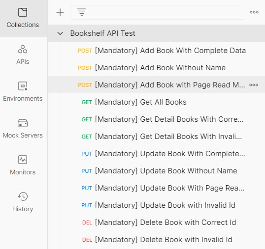
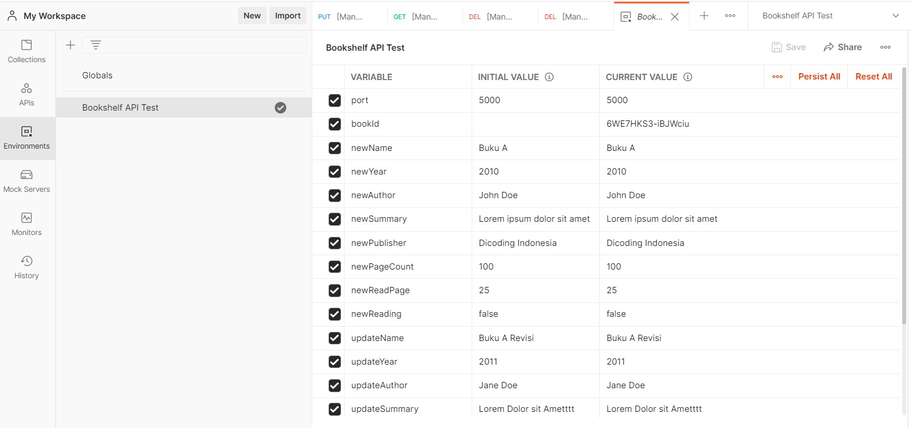

# Submission Bookshelf API

## Daftar ISI

- [Pengantar](#Pengantar)
- [Kriteria](#Kriteria)
- [Pengujian](#Pengujian)
- [Saran](#Saran)
- [Lainnya](#Lainnya)

# Pengantar

Selamat! Akhirnya Anda telah sampai di penghujung pembelajaran. Anda telah mempelajari:

- Istilah _back-end_, _front-end_, _server_, _client_, _web service_, REST API serta belajar cara berkomunikasi antara _
  client_ dengan _server_ menggunakan cURL.
- Dasar-dasar Node.js dalam pengembangan Back-End seperti _global object_, _process_, _modularization_, _event_, dan
  yang lainnya.
- Membangun _web server_ menggunakan Node.js _native_ maupun Hapi Framework. Selain itu, Anda sudah membuat RESTful API
  sederhana yang mendukung fungsionalitas aplikasi catatan.
- Melakukan _deploy_ RESTful API pada Amazon EC2.
- Pengujian RESTful API secara otomatis menggunakan Postman.

Tentu Anda juga sudah mengerjakan seluruh latihan yang diberikan pada kelas ini.

Untuk bisa lulus dan mendapatkan sertifikat dari akademi ini, Anda harus mengerjakan tugas yakni membuat proyek **
Bookshelf API** sesuai kriteria lengkap di bawah ini. Tim Reviewer akan memeriksa pekerjaan Anda dan memberikan reviu
pada proyek yang Anda buat.

# Submission

Terdapat 5 kriteria utama yang harus Anda penuhi dalam membuat proyek Bookshelf API.

### **Kriteria 1 : API dapat menyimpan buku**

API yang Anda buat harus dapat menyimpan buku melalui _route_:

- Method : **POST**
- URL : **/books**

Body Request:

```json
{
  "name": string,
  "year": number,
  "author": string,
  "summary": string,
  "publisher": string,
  "pageCount": number,
  "readPage": number,
  "reading": boolean
}
```

Objek buku yang disimpan pada _server_ harus memiliki struktur seperti contoh di bawah ini:

```json
{
  "id": "Qbax5Oy7L8WKf74l",
  "name": "Buku A",
  "year": 2010,
  "author": "John Doe",
  "summary": "Lorem ipsum dolor sit amet",
  "publisher": "Dicoding Indonesia",
  "pageCount": 100,
  "readPage": 25,
  "finished": false,
  "reading": false,
  "insertedAt": "2021-03-04T09:11:44.598Z",
  "updatedAt": "2021-03-04T09:11:44.598Z"
}
```

Properti yang ditebalkan diolah dan didapatkan di sisi _server_. Berikut penjelasannya:

- **id** : nilai **id** haruslah unik. Untuk membuat nilai unik, Anda bisa
  memanfaatkan [nanoid](https://www.npmjs.com/package/nanoid).
- **finished** : merupakan properti _boolean_ yang menjelaskan apakah buku telah selesai dibaca atau belum. Nilai finished
  didapatkan dari observasi **pageCount === readPage**.
- **insertedAt** : merupakan properti yang menampung tanggal dimasukkannya buku. Anda bisa gunakan **new Date().toISOString()**
  untuk menghasilkan nilainya.
- **updatedAt** : merupakan properti yang menampung tanggal diperbarui buku. Ketika buku baru dimasukkan, berikan nilai
  properti ini sama dengan **insertedAt**.

Server harus merespons **gagal** bila:

- Client tidak melampirkan properti namepada _request body_. Bila hal ini terjadi, maka _server_ akan merespons dengan:
    - Status Code : **400**
    - Response Body:

  ```json
  {
    "status": "fail",
    "message": "Gagal menambahkan buku. Mohon isi nama buku"
  }
  `````

- Client melampirkan nilai properti **readPage** yang lebih besar dari nilai properti **pageCount**. Bila hal ini terjadi,
  maka _server_ akan merespons dengan:
    - Status Code : **400**

    - Response Body:

  ```json
  {
    "status": "fail",
    "message": "Gagal menambahkan buku. readPage tidak boleh lebih besar dari pageCount"
  }
  ```

- Server gagal memasukkan buku karena alasan umum (_generic error_). Bila hal ini terjadi, maka _server_ akan merespons
  dengan:
    - Status Code : **500**
    - Response Body:
  ```json
  {
    "status": "error",
    "message": "Buku gagal ditambahkan"
  }
  ```

Bila buku **berhasil** dimasukkan, _server_ harus mengembalikan respons dengan:

- Status Code : **201**
- Response Body:

  ```json
  {
    "status": "success",
    "message": "Buku berhasil ditambahkan",
    "data": {
      "bookId": "1L7ZtDUFeGs7VlEt"
    }
  }
  ```

### **Kriteria 2 : API dapat menampilkan seluruh buku**

API yang Anda buat harus dapat menampilkan seluruh buku yang disimpan melalui _route_:

- Method : **GET**
- URL: **/books**

Server harus mengembalikan respons dengan:

- Status Code : **200**

- Response Body:

```json
{
  "status": "success",
  "data": {
    "books": [
      {
        "id": "Qbax5Oy7L8WKf74l",
        "name": "Buku A",
        "publisher": "Dicoding Indonesia"
      },
      {
        "id": "1L7ZtDUFeGs7VlEt",
        "name": "Buku B",
        "publisher": "Dicoding Indonesia"
      },
      {
        "id": "K8DZbfI-t3LrY7lD",
        "name": "Buku C",
        "publisher": "Dicoding Indonesia"
      }
    ]
  }
}
```

Jika **belum** terdapat buku yang dimasukkan, _server_ bisa merespons dengan _array_ books kosong.

```json
{
  "status": "success",
  "data": {
    "books": []
  }
}
```

### **Kriteria 3 : API dapat menampilkan detail buku**

API yang Anda buat harus dapat menampilkan seluruh buku yang disimpan melalui _route_:

- Method : **GET**
- URL: **/books/{bookId}**

Bila buku dengan **id** yang dilampirkan oleh _client_ tidak ditemukan, maka _server_ harus mengembalikan respons dengan:

- Status Code : **404**

- Response Body:

  ```json
  {
    "status": "fail",
    "message": "Buku tidak ditemukan"
  }
  ```

Bila buku dengan **id** yang dilampirkan **ditemukan** , maka _server_ harus mengembalikan respons dengan:

- Status Code : **200**

- Response Body:

  ```json
  {
    "status": "success",
    "data": {
      "book": {
        "id": "aWZBUW3JN\_VBE-9I",
        "name": "Buku A Revisi",
        "year": 2011,
        "author": "Jane Doe",
        "summary": "Lorem Dolor sit Amet",
        "publisher": "Dicoding",
        "pageCount": 200,
        "readPage": 26,
        "finished": false,
        "reading": false,
        "insertedAt": "2021-03-05T06:14:28.930Z",
        "updatedAt": "2021-03-05T06:14:30.718Z"
      }
    }
  }
  ```

### **Kriteria 4 : API dapat mengubah data buku**

API yang Anda buat harus dapat mengubah data buku berdasarkan **id** melalui _route_:

- Method : **PUT**
- URL : **/books/{bookId}**

- Body Request:

  ```json
  {
    "name": string,
    "year": number,
    "author": string,
    "summary": string,
    "publisher": string,
    "pageCount": number,
    "readPage": number,
    "reading": boolean
  }
  ```

Server harus merespons **gagal** bila:

- Client tidak melampirkan properti **name** pada _request body_. Bila hal ini terjadi, maka _server_ akan merespons dengan:
    - Status Code : **400**
    - Response Body:
      ```json
      {
        "status": "fail",
        "message": "Gagal memperbarui buku. Mohon isi nama buku"
      }
      ```

- Client melampirkan nilai properti **readPage** yang lebih besar dari nilai properti **pageCount**. Bila hal ini terjadi,
  maka _server_ akan merespons dengan:
    - Status Code : **400**
    - Response Body:
    ```json
    {
      "status": "fail",
      "message": "Gagal memperbarui buku. readPage tidak boleh lebih besar dari pageCount"
    }
    ```

- **Id** yang dilampirkan oleh _client_ tidak ditemukkan oleh _server_. Bila hal ini terjadi, maka _server_ akan merespons
  dengan:
    - Status Code : **404**
    - Response Body:
  ```json
  {
    "status": "fail",
    "message": "Gagal memperbarui buku. Id tidak ditemukan"
  }
  ```

Bila buku **berhasil diperbarui** , _server_ harus mengembalikan respons dengan:

- Status Code : **200**

- Response Body:

```json
{
  "status": "success",
  "message": "Buku berhasil diperbarui"
}
```

### **Kriteria 5 : API dapat menghapus buku**

API yang Anda buat harus dapat menghapus buku berdasarkan id melalui _route_ berikut:

- Method : **DELETE**
- URL: /books/{bookId}

Bila **id** yang dilampirkan tidak dimiliki oleh buku manapun, maka _server_ harus mengembalikan respons berikut:

- Status Code : **404**

- Response Body:

```json
{
  "status": "fail",
  "message": "Buku gagal dihapus. Id tidak ditemukan"
}
```

Bila **id** dimiliki oleh salah satu buku, maka buku tersebut harus dihapus dan _server_ mengembalikan respons berikut:

- Status Code : **200**

- Response Body:

```json
{
  "status": "success",
  "message": "Buku berhasil dihapus"
}
```

# Pengujian
Ketika membangun Bookshelf API, tentu Anda perlu menguji untuk memastikan API berjalan sesuai dengan kriteria yang ada. Kami sudah menyediakan berkas Postman Collection dan Environment yang dapat Anda gunakan untuk pengujian. Silakan unduh berkasnya pada tautan berikut:

- [Postman Bookshelf API Test Collection dan Environment](https://github.com/dicodingacademy/a261-backend-pemula-labs/raw/099-shared-files/BookshelfAPITestCollectionAndEnvironment.zip)

Anda perlu meng-_import_ kedua berkas tersebut pada Postman untuk menggunakannya. Caranya, ekstrakberkas yang sudah diunduh hingga menghasilkan dua berkas file JSON.



Kemudian pada aplikasi Postman, klik tombol **import** yang berada di atas panel kiri aplikasi Postman.



Kemudian klik tombol **Upload Files** untuk meng-_import_ kedua berkas JSON hasil ekstraksi.



Setelah itu, Bookshelf API Test Collection dan Environment akan tersedia pada Postman Anda.

| Collection |
| --- |
|  |
| Environment |
|  |

# Saran
Submission Anda akan dinilai oleh Reviewer guna menentukkan kelulusan Anda. Untuk lulus dari kelas ini, proyek Bookshelf API harus memenuhi seluruh pengujian otomatis pada Postman _request_ yang bertanda **[Mandatory]**. Bila salah satu pengujiannya gagal, maka proyek Anda akan kami tolak.

Submission Anda akan dinilai oleh Reviewer dengan **skala 1-5**. Untuk mendapatkan nilai tinggi, silakan penuhi pengujian otomatis pada _request_ yang bertanda **[Optional]**. Berikut detail dari fitur atau persyaratan opsional dari submission ini:

- Tambahkan fitur _query parameters_ pada _route_ **GET /books** (Mendapatkan seluruh buku).
  - **?name** : Tampilkan seluruh buku yang mengandung nama berdasarkan nilai yang diberikan pada _query_ ini. Contoh /books?name="dicoding", maka akan menampilkan daftar buku yang mengandung nama "dicoding" secara _ **non-case sensitive** _ (tidak peduli besar dan kecil huruf).
  - **?reading** : Bernilai 0 atau 1. Bila 0, maka tampilkan buku yang sedang tidak dibaca (reading: false). Bila 1, maka tampilkan buku yang sedang dibaca (reading: true). Selain itu, tampilkan buku baik sedang dibaca atau tidak.
  - **?finished** : Bernilai 0 atau 1. Bila 0, maka tampilkan buku yang sudah belum selesai dibaca (finished: false). Bila 1, maka tampilkan buku yang sudah selesai dibaca (finished: true). Selain itu, tampilkan buku baik yang sudah selesai atau belum dibaca.
- Menerapkan **CORS** pada seluruh _resource_ yang ada.
- Menggunakan ESLint dan salah satu _style__guide_ agar gaya penulisan kode JavaScript lebih konsisten.

Berikut adalah detail penilaian submission:

- **Bintang 1** : Semua ketentuan wajib terpenuhi, namun terdapat indikasi kecurangan dalam mengerjakan submission.
- **Bintang 2** : Semua ketentuan wajib terpenuhi, namun terdapat kekurangan pada penulisan kode. Seperti tidak menerapkan _modularization_ atau gaya penulisan tidak konsisten.
- **Bintang 3** : Semua ketentuan wajib terpenuhi, namun tidak terdapat improvisasi atau persyaratan opsional yang dipenuhi.
- **Bintang 4** : Semua ketentuan wajib terpenuhi dan menerapkan minimal satu persyaratan opsional.
- **Bintang 5** : Semua ketentuan wajib terpenuhi dan menerapkan seluruh persyaratan opsional yang ada.

| **Catatan:** Jika _submission Anda ditolak_ maka _tidak ada penilaian_. Kriteria penilaian bintang di atas hanya berlaku _jika submission Anda lulus_. |
| --- |


# Lainnya
### **Ketentuan Berkas Submission**

- Berkas submission yang dikirim merupakan folder proyek dari Bookshelf API dalam bentuk **ZIP**.
- Pastikan di dalam folder proyek yang Anda kirim terdapat berkas **package.json**.
- Pastikan Anda hapus dulu berkas **node\_modules** pada folder proyek sebelum mengkompresi dalam bentuk **ZIP**.

### **Submission Anda akan Ditolak bila**

- Kriteria wajib Bookshelf API tidak terpenuhi.
- Ketentuan berkas submission tidak terpenuhi.
- Proyek yang Anda kirim tidak dapat dijalankan dengan baik (Reviewer menggunakan Node.js versi **LTS 14.17.0** ).
- Menggunakan bahasa pemrograman dan teknologi lain, selain JavaScript dan Node.js.
- Menggunakan Framework Node.js **selain Hapi Framework**.
- Melakukan kecurangan seperti tindakan plagiasi.

### **Ketentuan Proses Review**

Beberapa hal yang perlu Anda ketahui mengenai proses _review_:

- Tim Reviewer akan mengulas submission Anda dalam waktu **selambatnya 3 (tiga) hari kerja** (_tidak termasuk Sabtu, Minggu,_ dan _hari libur nasional_).
- Karena kelas ini merupakan kelas Pemula, **mekanisme** proses review pada kelas ini hanya _pengetesan aplikasi_ dan _tidak dengan kode_. Untuk mendapatkan hasil review yang lebih komprehensif Anda dapat mengikuti kelas selanjutnya.
- Tidak disarankan untuk melakukan _submit berkali-kali_ karena akan memperlama proses penilaian.
- Anda akan mendapatkan notifikasi hasil review submission via email. Status submission juga bisa dilihat dengan mengecek di halaman [submission](https://www.dicoding.com/academysubmissions/my).
